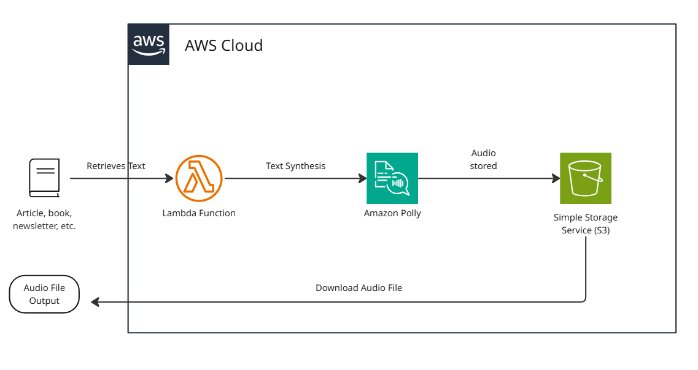
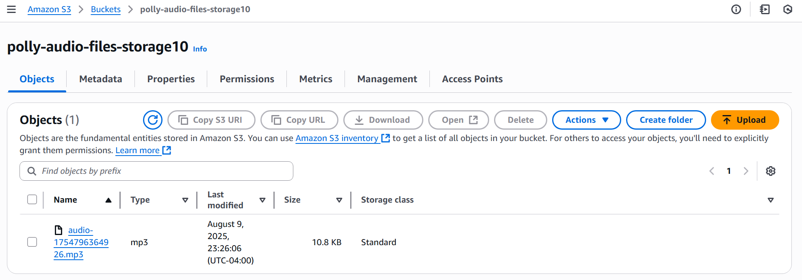

# AWS Polly Text Narrator Application
A Node.js-based serverless application that uses **Amazon Polly** to convert text into high-quality speech and store the generated audio in **Amazon S3**. This project demonstrates text-to-speech (TTS) capabilities using AWS services, Infrastructure as Code with **AWS SAM** and **Terraform**, as well as secure serverless deployment with **AWS IAM**. Users provide text input to a Lambda function, which synthesizes the audio via Polly and stores the `.mp3` file in S3 for download or playback.

## Architecture Overview
  
*Figure 1: Architecture diagram of the AWS Polly Text Narrator Application.*

**Core Components**  
- **AWS Lambda** – Serverless function that processes text and calls Amazon Polly.  
- **Amazon Polly** – Text-to-Speech service that generates high-quality speech.  
- **Amazon S3** – Storage for generated `.mp3` files.  
- **IAM** – Manages permissions for Lambda to access Polly and S3.  
- **Node.js AWS SDK v3** – Used within Lambda for Polly and S3 interactions.

## Skills Applied
- Developing Lambda functions with AWS SDK v3 for Node.js.  
- Integrating Amazon Polly for TTS functionality.  
- Managing permissions via IAM roles and managed policies.  
- Provisioning AWS resources using CloudFormation, SAM, and Terraform.  
- Implementing serverless architecture patterns.

## Features
- Converts user-provided text into MP3 audio files.  
- Supports selection of Polly’s voice models.
- Stores audio files securely in Amazon S3.  
- Serverless deployment for cost-efficiency and scalability.  
- Infrastructure defined with both **AWS SAM** and **Terraform**.

## Tech Stack
- **Languages:** Node.js 22.18 (JavaScript)   
- **AWS Services:** Lambda, Polly, S3, IAM  
- **IaC Tools:** CloudFormation, AWS SAM, Terraform  
- **Other Tools:** AWS CLI

## Deployment Instructions
> **Note:** All command-line examples use `bash` syntax highlighting to maximize compatibility and readability.  
> If you are using PowerShell or Command Prompt on Windows, the commands remain the same but prompt styles may differ.

To provision the required AWS infrastructure, deploy using **SAM** or **Terraform** templates as included in this repository.

### Option 1: **SAM**
1. Install Lambda dependencies (only needed the first time or when dependencies change):
   ```bash
   cd ../src
   npm install
   ```
   
2. Navigate to the `cloudformation` folder, build, and deploy:
   ```bash
   cd cloudformation
   sam build
   sam deploy --guided --capabilities CAPABILITY_NAMED_IAM
   ```

3. Provide parameters when prompted (Stack Name, AWS Region, etc.).

### Option 2: **Terraform**
1. Edit variables in `terraform.tfvars` and/or `variables.tf` to customize the deployment.

2. Install Lambda dependencies (only needed the first time or when dependencies change):
   ```bash
   cd ../src
   npm install
   ```
   
3. Navigate to the `terraform` folder and deploy:
   ```bash
   cd terraform
   terraform init
   terraform plan # Optional, but recommended.
   terraform apply
   ```

**Note:** Node.js 22.x or later with npm is required to deploy via CloudFormation/SAM. Ensure the AWS CLI is configured (`aws configure`) with credentials that have sufficient permissions to create **S3 buckets**, deploy **Lambda functions**, interact with **Amazon Polly**, and manage **IAM roles**.

## How to Use
1. **Deploy the infrastructure** using SAM or Terraform.

2. **Edit the event file** `src/events/event.json` with the desired output:
   ```json
   {
     "text": "The text to be converted to Audio"
   }
   ```

3. **Invoke the Lambda function**  

   **3a. Use the AWS CLI:**
	 
     ```bash
     aws lambda invoke \
	 --function-name PollyNarratorFunction \
	 --invocation-type RequestResponse \
	 --payload fileb://src/events/event.json \
	 src/events/response.json
     ```

   **3b. Use the AWS Management Console:**
   - Navigate to **Lambda** and select the function.  
   - Select **Test**.
	 - Select **Create new event**
   - Enter an **Event name**.
   - In Event JSON, enter the contents of the event.json file.
   - Select **Test** in the upper right of the Test event dialog.

4. **Check the S3 bucket** for the generated `.mp3` audio file. Download or play the file as needed.

## Project Structure
```plaintext
aws-polly-text-narrator/
├── assets/                      # Images, diagrams, screenshots
│   ├── architecture-diagram.png      # Project architecture
│   └── sample-terminalresults.png    # Sample Lambda output
├── cloudformation/              # AWS SAM template
│   └── template.yaml                 # Main SAM template
├── terraform/                   # Terraform templates
│   ├── main.tf                       # Main Terraform config
│   ├── variables.tf                  # Input variables
│   ├── outputs.tf					  # Exported values
│   ├── terraform.tfvars              # Default variable values
│   ├── providers.tf			      # AWS provider definition
│   └── versions.tf					  # Terraform version constraint
├── src/                         # Lambda source code, dependencies, and events
│   ├── polly_function/		          # Lambda function
│   │   ├── index.js                       
│	│   ├── package.json                   
│	│   └── package-lock.json              
│   └── events/				          # Lambda test events
│       └── event.json                     
├── LICENSE                      
├── README.md                    
└── .gitignore                   
```

## Screenshot


*Figure 2: Example Lambda invocation output showing generated audio file key.*

## Future Enhancements
- **API Gateway Integration** – Provide a REST endpoint for text submissions.
- **Presigned S3 URLs** – Enable secure, time-limited audio downloads.
- **Multi-Language Support** – Integrate **Amazon Translate** to automatically translate text into multiple languages before speech synthesis.
- **Event-Driven Automation** – Use S3 or API Gateway triggers for real-time processing.

## License
This project is licensed under the [MIT License](LICENSE).

---

## Author
**Patrick Heese**  
Cloud Administrator | Aspiring Cloud Engineer/Architect  
[LinkedIn Profile](https://www.linkedin.com/in/patrick-heese/) | [GitHub Profile](https://github.com/patrick-heese)

## Acknowledgments
This project was inspired by a course from [techwithlucy](https://github.com/techwithlucy).  
The Lambda function code is taken directly from the author's original implementation.  
The architecture diagram included here is my own version, adapted from the original course diagram.  
I designed and developed all Infrastructure-as-Code (CloudFormation, SAM, Terraform) and project documentation.  
